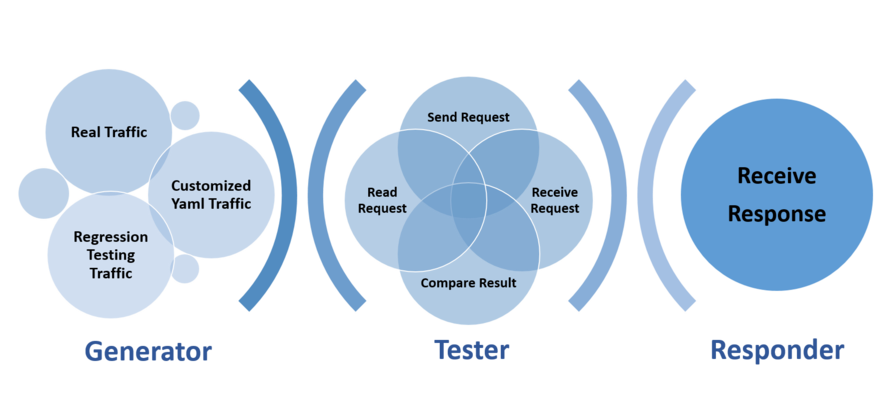

```
 __     __     ______     ______      ______     ______     __   __     ______     __  __    
/\ \  _ \ \   /\  __ \   /\  ___\    /\  == \   /\  ___\   /\ "-.\ \   /\  ___\   /\ \_\ \   
\ \ \/ ".\ \  \ \  __ \  \ \  __\    \ \  __<   \ \  __\   \ \ \-.  \  \ \ \____  \ \  __ \  
 \ \__/".~\_\  \ \_\ \_\  \ \_\       \ \_____\  \ \_____\  \ \_\\"\_\  \ \_____\  \ \_\ \_\ 
  \/_/   \/_/   \/_/\/_/   \/_/        \/_____/   \/_____/   \/_/ \/_/   \/_____/   \/_/\/_/ 
                                                                                             
```

# WAF Bench (WB) Tool Suits

WAF (Web Application Firewall) Bench (WB) tool suits is designed to verify the correctness and measure the performance of WAF.

## Motivation

WAF behaves differently when fed with varied traffic, so making sure that the accelerated WAF has the same effort compared with the original one (under different traffic) matters.

If we achieved the first goal some solid benchmark is needed to prove to the world that our WAF is well optimized (and worth a good price).

## Architecture



As you can see, WB Generator can provide all kinds of traffic based on real world, theory or special case. Taking generated requests as input, the Tester is able to read, send, receive and compare them with expected ones (ASAP, so benchmark also is available). Responder supports custom responses, which is very useful when testing real traffic.

## Features

- **Support Stress Performance Testing:** Generate the same traffic as Apache Bench (AB) and do the performance testing.

## Usage

### Prerequisites

Some software or libraries may be necessary for further build / usage. All of them are listed below:

- **C Compiler** with good C11 support (tested with gcc 4.8)
- **C++ Compiler** with good C++11 support (tested with g++ 4.8)
- **pthread** library (tested with glibc 2.17, which includes pthread)
- **GNU Make** (tested with GNU Make 3.82)
- **libev** library (tested with libev 4.0.0)
- **CMake** 2.8 or higher (tested with CMake 2.8)
- **Boost** libraries (tested with 1.53.0)
- **Python** 2 (tested with 2.75)
- **pip** python package management tool (tested with 8.1.2)
- **ftw** python module (tested with ftw 1.1.4)
- **wget** library (tested with wget-1.14-15.e17_4.1)
- **expat** library (tested with expat-devel-2.1.0-10.e17_3)
- **openssl** library (tested with openssl-devel-1.0.2k-12.e17)

The WB tool suites are developed and tested under CentOS 7 (Linux version 3.10, AMD 64 architecture) in a 32 core (Intel Xeon E5 @ 2.30GHz) Server.

**Note**: If you don't aim to conduct complex WAF testing tasks there is a *cheat sheet* below summarizing common testing instructions ranging from install to usage, by which you can focus on your goal; The *Advance Usage* section just gives you more detailed information of WB if considering it as a black box cannot satisfy your demand.

### Cheat Sheet

This tutorial is based on CentOS 7 (Linux version 3.10, AMD 64 architecture) but other Linux distributions is OK since there is no dependencies on CentOS.

#### Install Dependencies

##### On CentOS:

Before installing dependencies using yum in CentOS, we recommend you to enable the EPEL repo to find some packages listed below (`yum --enablerepo=extras install epel-release`).

However you can find these packages in your own source using 'yum search ...'

```
yum install gcc gcc-c++ make                # Install build-essential
yum install libev-devel.x86_64              # Install development headers for libev
yum install cmake                           # Install CMake
yum install boost-devel.x86_64              # Install boost libraries
yum install python                          # Install python
yum install python2-pip.noarch              # Install python pip
pip install ftw                             # Install ftw module
yum install wget.x86_64                     # Install wget
yum install expat-devel                     # Install expat
yum install openssl-devel                   # Install openssl
```

or just type

```
yum install gcc gcc-c++ make libev-devel.x86_64 cmake boost-devel.x86_64 python python2-pip.noarch wget.x86_64 expat-devel openssl-devel
pip install ftw
```

#### Download WB tools suits 

Just clone this repo to your machines.

#### Install WB

Please refer to [WB Readme](./wb/README.md)

#### Conduct Performance Test / AB-like Test

Assuming that the server is at 10.0.1.1:18081 running we can:

```
wb -t 10 -c 20  10.0.1.1:18081
```

Or send requests from a file such as *requests.dat*:

```
wb -t 10 -c 25 -F requests.dat 10.0.1.1:18081
```

* About the format of request file, please refer to [WB Readme](./wb/README.md)

### Advance Usage

Since the components are independent to each other, the detailed build, install and use tutorials are maintained in their own folder. You can access them at:

* WB
  * [WB](./wb/README.md)

## Changelog

For changelog, you may refer to [CHANGELOG.md](CHANGELOG.md).
